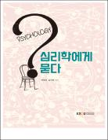

# 심리학에게묻다
> 컴퓨터과학과 | 2025년  1학년 2학기 | 교양 | 3학점  
> 주차 : 15강  

  

## 강의 개요
> 『심리학에게 묻다』는 우리가 살아가면서 대인관계에서 경험하는 다양한 문제들에 대해 질문해 보고, 이 질문에 대해 심리학이 답함으로써, 이 문제와 관련된 심리학적 원리를 공부하는 형식으로 구성되어 있다. 강의는 1부 나와 관계 이해하기의 9개의 장과, 2부 삶에 적용하기의 6개의 장으로 구성되어 있다. 이 강의를 통해, 우리 삶에서 누구나 경험하는 소소한 문제들에 대한 궁금증에 대해 심리학적인 기본 원리를 바탕으로 답을 찾아보고자 하였다. 심리학을 딱딱하게만 여겼던 이들, 모호하고 멀다고 생각했던 이들에게 심리학과 조금이나마 친해지는데 이강의가 도움이 되기를 바란다. 그리고 우리 삶에서 질문이 있을 때마다 그냥 지나치지 않고 끊임없이 물어보는 우리들이 되기를 바란다. 물음에는 답이 있기 때문이다. 수많은 궁금증을 안고 살아갈 수밖에 없는 지금의 우리들이지만 하나씩 묻고 답해가며 그렇게 서로를 이해하가는 우리가 되기를 바란다.  

 

(제작PD : 이지선)

  

---

## 교수 소개
> ### 하혜숙  
> 교육과학대학 청소년교육복지상담학과교수  

  

---

## 교재 정보
<table><tr><td></td><td><h3>심리학에게묻다</h3>
집필(하혜숙, 강지현) 지음 | 출판문화원
 
종이책
20,000원

</td></tr></table>

  

---

## 강의 목차
> [1강. 내 인상이 어때서?](./01_What_s_wrong_with_my_impression_.md)  
[1강. 내 인상이 어때서?](./01_What_s_wrong_with_my_impression_.md)  
[2강. 관계의 출발](./02_The_beginning_of_a_relationship.md)  
[3강. 참을 수 없는 존재의 부끄러움](./03_The_Shame_of_an_unbearable_existence.md)  
[4강. 마음의 스크래치](./04_Scratch_of_mind.md)  
[5강. 절대 닮고 싶지 않은 나의 부모](./05_My_parents_I_never_want_to_be_like.md)  
[6강. 내가 찍는 판타지 영화](./06_Fantasy_movie_I_take.md)  
[7강. 마음의 방패에 대한 이해](./07_Understanding_the_shield_of_mind.md)  
[8강. 멀고도 가까운 관계](./08_So_close_yet_so_far.md)  
[9강. 뇌의 먹이는 무엇일까?](./09_What_is_the_feed_of_the_brain_.md)  
[10강. 삶의 폭풍 지나가기](./10_Passing_the_storm_of_life.md)  
[11강. 머리와 엉덩이](./11_Head_and_butt.md)  
[12강. 당근과 채찍](./12_Carrots_and_Stick.md)  
[13강. 나의 갈등 스타일](./13_My_conflict_style.md)  
[14강. 마음의 소리 듣기](./14_Listening_to_the_Voice_of_the_Heart.md)  
[15강. 마음 트레이닝](./15_Mind_training.md)  
  