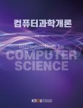

# 컴퓨터과학 개론
> 컴퓨터과학과 | 2025년  1학년 2학기 | 전공 | 3학점  
> 주차 : 15강  

  

## 강의 개요
> ‘컴퓨터과학개론’은 컴퓨터과학을 전공하는 1학년 학생을 대상으로 컴퓨터과학 전반에 걸친 핵심 내용을 소개하는 과목이다. 즉, 어떤 특정한 컴퓨팅 도구나 컴퓨터 이론/응용에 관련된 내용을 배우는 것이 아니라, 여러분들이 앞으로 상위 학년으로 올라가면서 배우게 될 컴퓨터과학의 여러 핵심 분야의 내용을 개괄적으로 살펴보는 과목으로, 컴퓨터과학의 다양한 분야에 걸친 용어, 개념, 원리 및 방법 등을 미리 접해봄으로써 친숙해질 수 있는 기회와 환경을 제공하는 것이 가장 중요한 학습 목표라고 할 수 있다.  

 

(제작PD : 배상욱)

  

---

## 교수 소개
> ### 이관용  
> 자연과학대학 컴퓨터과학과교수 
> ### 정광식  
> 자연과학대학 컴퓨터과학과교수  

  

---

## 교재 정보
<table><tr><td></td><td><h3>컴퓨터과학개론</h3>
집필(이관용, 정광식) 지음 | 출판문화원
 
E-book
7,100원
(180일 대여)

</td></tr><tr><td></td><td><h3>컴퓨터과학개론</h3>
집필(이관용, 정광식) 지음 | 출판문화원
 
종이책
14,200원

</td></tr></table>

  

---

## 강의 목차
> [1강. 컴퓨터와 자료 (1)        ](./01_Computer_and_Data1.md)  
[1강. 컴퓨터와 자료 (1)        ](./01_Computer_and_Data1.md)  
[2강. 컴퓨터와 자료 (2)        ](./02_Computer_and_Data2.md)  
[3강. 자료구조 (1)         ](./03_Data_Structure1.md)  
[4강. 자료구조 (2)         ](./04_Data_Structure2.md)  
[5강. 알고리즘 (1)         ](./05_Algorithm1.md)  
[6강. 알고리즘 (2)         ](./06_Algorithm2.md)  
[7강. 운영체제 (1)](./07_Operating_System1.md)  
[8강. 운영체제 (2)](./08_Operating_System2.md)  
[9강. 컴퓨터 구조 (1)](./09_Computer_Architecture1.md)  
[10강. 컴퓨터 구조 (2)](./10_Computer_Architecture2.md)  
[11강. 프로그래밍 언어 (1)         ](./11_Programming_Language1.md)  
[12강. 프로그래밍 언어 (2)         ](./12_Programming_Language2.md)  
[13강. 데이터베이스 (1)         ](./13_Database1.md)  
[14강. 데이터베이스 (2)         ](./14_Database2.md)  
[15강. 컴퓨터 네트워크         ](./15_Computer_Network.md)  
  