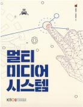

# 멀티미디어시스템
> 컴퓨터과학과 | 2025년  1학년 2학기 | 전공 | 3학점  
> 주차 : 15강  

  

## 강의 개요
> 컴퓨터 관련기술은 급속도로 변하고 있다. 멀티미디어란 텍스트, 오디오, 비디오, 애니메이션, 그래픽 등이 결합된 환경을 말하는데 이러한 멀티미디어 환경과 관련 기술은 너무도 빠르게 변하고 있다. 본 과목에서는 21세기 고도 정보화 사회에서 필수적으로 활용되는 멀티미디어 관련 기술을 습득하기 위해 멀티미디어시스템의 기본적인 개념을 알아보고 멀티미디어 활용기술에 관해 학습하며 마지막으로 멀티미디어 응용에 관한 내용을 제공하고자 한다.
그러나 여기서 제공되는 내용이 방대한 바 학습의 효과를 극대화하기 위하여 학생들은 반드시 사전에 예습을 한 후 방송강의를 청취할 것을 권하는 바이다.  

 

(제작PD : 박성화)

  

---

## 교수 소개
> ### 김형근  
> 자연과학대학 컴퓨터과학과교수  

  

---

## 교재 정보
<table><tr><td></td><td><h3>멀티미디어시스템</h3>
집필(김형근, 곽덕훈) 지음 | 출판문화원
 
E-book
9,250원
(180일 대여)

</td></tr><tr><td></td><td><h3>멀티미디어시스템</h3>
집필(김형근, 곽덕훈) 지음 | 출판문화원
 
종이책
18,500원

</td></tr></table>

  

---

## 강의 목차
> [1강. 멀티미디어개요](./01_Multimedia_Overview.md)  
[1강. 멀티미디어개요](./01_Multimedia_Overview.md)  
[2강. 멀티미디어시스템 환경](./02_Multimedia_System_Environment.md)  
[3강. 멀티미디어 데이터(1) - 텍스트](./03_Multimedia_Data1__text.md)  
[4강. 멀티미디어 데이터(2) - 사운드](./04_Multimedia_Data2__Sound.md)  
[5강. 멀티미디어 데이터(3) - 이미지와 그래픽](./05_Multimedia_Data3__image_and_graphics.md)  
[6강. 멀티미디어 데이터(4) - 비디오와 애니메이션](./06_Multimedia_Data4__Video_and_Animation.md)  
[7강. 멀티미디어 데이터 압축(1)](./07_Multimedia_data_compression1.md)  
[8강. 멀티미디어 데이터 압축(2)](./08_Multimedia_data_compression2.md)  
[9강. 웹과 멀티미디어(1)](./09_Web_and_Multimedia1.md)  
[10강. 웹과 멀티미디어(2)](./10_Web_and_Multimedia2.md)  
[11강. 멀티미디어 활용(1)](./11_Multimedia_Application1.md)  
[12강. 멀티미디어 활용(2)](./12_Multimedia_Application2.md)  
[13강. 모바일 멀티미디어(1)](./13_Mobile_Multimedia1.md)  
[14강. 모바일 멀티미디어(2)](./14_Mobile_Multimedia2.md)  
[15강. 멀티미디어의 미래](./15_The_future_of_multimedia.md)  
  