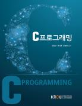

# C프로그래밍
> 컴퓨터과학과 | 2025년  1학년 2학기 | 전공 | 3학점  
> 주차 : 15강  

  

## 강의 개요
> C는 1972년에 개발된 프로그래밍 언어로, 다양한 응용을 구현하는 데 사용될 수 있는 범용 프로그래밍 언어이지만 하드웨어 중심의 저급언어 수준의 특성도 포함하고 있고 매우 빠른 실행코드를 만들어 낼 수 있어 시스템 프로그래밍에 적합한 언어이다. 따라서 C를 학습하는 것은 프로그래밍 언어와 함께 컴퓨터에 대한 기본을 이해하는 데 도움이 된다.
또한 C는 그 이후에 등장한 C++, C#, Java, Python 등 다양한 언어에 영향을 주어, C를 잘 학습하면 다른 언어를 이해하는 데도 큰 도움이 된다.
본 과목의 목표는 C언어에 대한 전반적인 개념과 문법을 익히고, 이를 프로그램 작성에 활용할 수 있는 능력을 함양하는 것이다. 언어를 학습하는 것이므로 충분한 실습을 병행하여 충분한 활용 능력을 갖출 수 있기를 바란다.  

 

(제작PD : 심주현)

  

---

## 교수 소개
> ### 이병래  
> 자연과학대학 컴퓨터과학과교수  

  

---

## 교재 정보
<table><tr><td></td><td><h3>C프로그래밍</h3>
집필(김형근, 곽덕훈, 정재화) 지음 | 출판문화원
 
E-book
7,500원
(180일 대여)

</td></tr><tr><td></td><td><h3>C프로그래밍</h3>
집필(김형근, 곽덕훈, 정재화) 지음 | 출판문화원
 
종이책
15,000원

</td></tr></table>

  

---

## 강의 목차
> [1강. C 언어의 개요](./LECTURE01/01_Overview_of_C_Language.md)  
[2강. 자료형과 선행처리기](./LECTURE02/02_Data_Type_and_Preprocessor.md)  
[3강. 입.출력 함수와 연산자(1)](./LECTURE03/03_IO_Functions_and_Operators1.md)  
[4강. 입.출력 함수와 연산자(2)](./LECTURE04/04_IO_Functions_and_Operators2.md)  
[5강. 선택 제어문과 반복 제어문](./LECTURE05/05_Selection_and_Iteration_Control_Statements.md)  
[6강. 함수와 기억 클래스(1)](./LECTURE06/06_Functions_and_Storage_Classes1.md)  
[7강. 함수와 기억 클래스(2)](./LECTURE07/07_Functions_and_Storage_Classes2.md)  
[8강. 배열과 포인터(1)](./LECTURE08/08_Arrays_and_pointers1.md)  
[9강. 배열과 포인터(2)](./LECTURE09/09_Arrays_and_pointers2.md)  
[10강. 배열과 포인터(3)](./LECTURE10/10_Arrays_and_pointers3.md)  
[11강. 구조체와 공용체(1)](./LECTURE11/11_Structures_and_Unions1.md)  
[12강. 구조체와 공용체(2)](./LECTURE12/12_Structures_and_Unions2.md)  
[13강. 파일처리 함수](./LECTURE13/13_File_Processing_Functions.md)  
[14강. 메모리 동적 할당](./LECTURE14/14_Dynamic_Memory_Allocation.md)  
[15강. C++언어의 개요](./LECTURE15/15_Overview_of_Cpp_Language.md)  
  