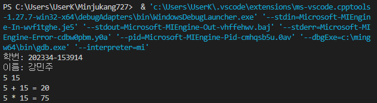

# 출석수업 과제물(평가결과물) 표지<span style="color:blue">(온라인제출용)</span>

 교과목명 : C프로그래밍  
 학    번 : 202334-153914  
 성    명 : 강민주  
 강 의 실 : 전북(온라인)온라인(ZOOM)2호  
 연 락 처 : 010-8733-8662  
__________________________________________________________________________________
모든 프로그램에서 `main` 함수의 처음에 학번과 이름을 반복해서 출력해야했기 때문에  
`main`함수에서 직접 `printf()`함수를 사용하기 보다 헤더 파일에 매크로 함수를 정의하고  
각 프로그램에서 해당 헤더 파일을 포함하는 선행처리기를 사용하여  
정의한 매크로 함수를 `main` 함수에서 호출하는 방법을 사용하였습니다.  

`myName.h`
```c
#define Hello printf("학번: 202334-153914\n이름: 강민주\n")
```

`main함수를 포함한 프로그램`
```c
#include "myName.h"

int main() {
    Hello;
    ...
}
```

<br>

---

### [예제 1] int형의 값을 두 개 입력하여 이들의 합과 곱 구하고, 그 값을 출력하는 프로그램을 완성하라.

`AddMul.c`
```c
#include <stdio.h>
#include "myName.h"

int main() {
    Hello;
    int a, b;       // int형 변수 a와 b를 선언
    int sum, mul;  // int형 변수 sum과 mul을 선언
    scanf("%d %d", &a, &b);  // a와 b에 값을 입력
    sum = a + b;
    mul = a * b;
    printf("%d + %d = %d\n", a, b, sum);  // a + b = sum 출력
    printf("%d * %d = %d\n", a, b, mul);  // a * b = mul 출력
}
``` 

- 실행 결과  
    

---
### [예제 2] 문자열을 입력하고, “Hello, 입력문자열!” 형태로 출력하는 프로그램을 완성하라.

`Hello.c`
```c
#include <stdio.h>
#include "myName.h"

int main() {
    Hello;
    char str[100];		// 문자열을 입력할 문자 배열
    printf("Who RU? ");
    scanf("%s", str);	// str에 문자열을 입력
    printf("Hello, %s!\n", str);	// “Hello, 입력문자열!” 출력
}
```

- 실행 결과  
    

<br>

---
### [예제 3] 다음 세 개의 소스코드에서 중복되는 부분을 헤더파일로 만들어 수정하라.

- 새로 정의한 헤더 파일  

    `d.c`
    ```c
    #define A 1
    #define B 2
    #define C 3
    #define mul(x, y, z) ((x) * (y) * (z))
    ```
-  소스 코드 중복되는 부분 → `#include "d.c"`  

    `main.c`
    ```c
    #include <stdio.h>
    #include "d.h"
    #include "f.c"
    #include "g.c"
    #include "myName.h"

    int main() {
        Hello;
        int a = 15, b = 10, c = 25;
        printf("%d, %d, %d\n", A, B, C);
        printf("%d\n", f(a, b, c) + g(a, b, c));
    }
    ```
    - 실행 경과  
        

    `f.c`
    ```c
    #include "d.h"

    int f(int x1, int x2, int x3) {
        return mul(x1 - A, x2 - B, x3 - C);
    }
    ```

    `g.c`
    ```c
    #include "d.h"

    int g(int x1, int x2, int x3) {
        return mul(x1 + A, x2 + B, x3 + C);
    }
    ```

<br>

---
### [예제 4] 다음 코드의 공란에 적절한 내용을 넣어 완성하라.


`ShortLimits.c`
```c
#include <stdio.h>
#include <limits.h>
#include "myName.h"

int main() {
    Hello;
    short int minShrt = SHRT_MIN;   // short int형의 최솟값
    short int maxShrt = SHRT_MAX;   // short int형의 최댓값
    printf("short int의 크기: %zu\n", sizeof(short int));
    printf("short int 자료형 범위: %d ~ %d\n", minShrt, maxShrt);
}
``` 
- 실행 결과  
    

`FloatLimits.c`
```c
#include <stdio.h>
#include <float.h>
#include "myName.h"

int main() {
    Hello;
    float minFlt = FLT_MIN;   // float형의 가장 미세한 값
    float maxFlt = FLT_MAX;   // float형의 가장 큰한 값
    printf("float의 크기: %zu\n", sizeof(float));
    printf("float 자료형 범위: %e ~ %e\n", minFlt, maxFlt);
}
```
- 실행 결과  
    

<br>

---
### [예제 5] 다음 두 코드를 각각 실행하여 결과를 구하고, 결과의 차이가 나는 이유를 설명하라.

`InitL.c`
```c
#include <stdio.h>
#include "myName.h"

int f() {
    int x = 0;  // 지역변수
    x = x + 1;
    return x;
}

int main() {
    Hello;
    printf("%d\n", f());
    printf("%d\n", f());
    printf("%d\n", f());
}
```

- 실행 결과  
    

`InitG.c`
```c
#include <stdio.h>
#include "myName.h"

int x = 0;  // 전역 변수

int f() {
    x = x + 1;
    return x;
}

int main() {
    Hello;
    printf("%d\n", f());
    printf("%d\n", f());
    printf("%d\n", f());
}
```

- 실행 결과  
    


지역변수는 함수 내부에서 선언된 변수로 선언된 함수의 내부에서만 인식됩니다.   
`InitL.c`의 변수 `x`는 함수 `f()` 내부에서 선언된 지역변수입니다.  
즉, 함수 `f()`가 호출될 때마다 새롭게 생성되고 함수의 실행이 끝나면 기억공간에서 소멸되어 더 이상 사용할 수 없기 때문에 함수 `f()`의 반환값은 항상 1이 됩니다.  
따라서 `InitL.c`의 실행 결과,  
```c
1
1
1
```
이 출력됩니다.  

전역변수는 함수 외부에서 선언된 변수로 프로그램 어디에서나 쓸 수 있습니다.  
`InitG.c`의 변수 `x`는 함수 외부에서 선언된 전역변수입니다.  
즉, 전역 변수 `x`가 처음 선언된 이후, 함수 `f()`가 호출될 때마다 변수 `x`에 저장된 값을 가져와 1을 더한 결과값을 반환하게됩니다.  
따라서 `InitG.c`의 실행 결과,  
```c
1
2
3
```
이 출력됩니다.  

<br>

---
### [예제 6] 정수를 입력한 다음 그 값을 3으로 나눈 나머지가 0인 수, 1인 수, 2인 수의 합을 각각 구하려고 한다. 정수 입력이 음수이면 반복을 중지하고 각각의 합을 출력한다. ㈀과 ㈁을 완성하라. ㈁은 if문을 이용하는 방법과 switch문을 이용하는 방법으로 각각 작성하라.

- if문을 이용하는 방법  

    `SubT_sol1.c`
    ```c
    #include <stdio.h>
    #include "myName.h"

    int main() {
        Hello;
        int sumR0, sumR1, sumR2, num;
        sumR0 = sumR1 = sumR2 = 0;
        printf("Input : ");
        scanf("%d", &num);
        while (num >= 0) {
            int remain = num % 3;

            if (remain == 0) {
                sumR0 += num;
            } else if (remain == 1) {
                sumR1 += num;
            } else {
                sumR2 += num;
            }
            
            printf("Input : ");
            scanf("%d", &num);
        }
        printf("나머지가 0인 수의 합 = %d\n", sumR0);
        printf("나머지가 1인 수의 합 = %d\n", sumR1);
        printf("나머지가 2인 수의 합 = %d\n", sumR2);
    }
    ```  
    - 실행 결과  
        

<br>

- switch문을 이용하는 방법

    `SubT_sol2.c`
    ```c
    #include <stdio.h>
    #include "myName.h"

    int main() {
        Hello;
        int sumR0, sumR1, sumR2, num;
        sumR0 = sumR1 = sumR2 = 0;
        printf("Input : ");
        scanf("%d", &num);
        while (num >= 0) {
            int remain = num % 3;

            switch (remain)
            {
            case 0:
                sumR0 += num;
                break;
            case 1:
                sumR1 += num;
                break;
            case 2:
                sumR2 += num;
                break;
            default:
                break;
            }
            printf("Input : ");
            scanf("%d", &num);
        }
        printf("나머지가 0인 수의 합 = %d\n", sumR0);
        printf("나머지가 1인 수의 합 = %d\n", sumR1);
        printf("나머지가 2인 수의 합 = %d\n", sumR2);
    }
    ```
    - 실행 결과  
        