> 이전 시간 안내  
> [1강. C 언어의 개요](../lecture01/01_Overview_of_C_Language.md)  

<br>

# 2강. 자료형과 선행처리기  

> ## 학습 목차  
> [1. 자료형과 상수](#1-자료형과-상수)  
> [2. 변수](#2-변수)  
> [3. 선행처리기](#3-선행처리기)  

## 1. 자료형과 상수

### 1. 자료형의 개념
- 자료형(data type)이란?
    - 컴퓨터에서 값의 표현 방법을 정의한 것
        - 값의 종류에 따른 표현 방법
            - 각 자료형에 해당되는 2진수 표현 방법을 사용함.
        - 값을 표현하기 위한 메모리 공간
        - 값을 대상으로 수행할 수 있는 연산
    - 값을 저장하거나 계산을 할 때 자료형을 엄격하게 구분하여 처리함.
        - 필요한 경우 자료형을 변환하여 올바른 처리가 이루어질 수 있게 해야 함.

### 2. C언어 자료형의 종류
- 기본형(primitive types)
    > 기본적인 숫자를 표현하는 자료형  
    - 정수형 : `short int`, `long int`, `long long int` ➡️ `signed` 또는 `unsigned`
        - *`int`는 생략 가능*
            - `short int` ➡️ `short`
            - `long int` ➡️ `long`
            - `long long int` ➡️ `long long`
        - *딱 딱 끊어져있는 이산적인 값을 정의하는 것*
        - *양수만 사용할 것인지(`unsigned`), 혹은 양수와 음수 모두 사용할 것인지(`signed`)에 따라  
            `signed`와 `unsigned`로 나뉨*
            - `signed` : 맨 첫 비트는 부호를 나타내고 나머지 7bit로 숫자를 표현
            - `unsigned` : 부호 비트 없이 8bit로 숫자를 표현
            - 예: `signed short int`, `signed long int`, `signed long long int`,  
                `unsigned short int`, `unsigned long int`, `unsigned long long int`
    - 문자형 : `char` ➡️ `signed` 또는 `unsigned`
        - 1byte를 이용하여 표현하는 코드(코드이기 때문에 정수와 유사한 표현을 하게 됨.)
        - ASCII 코드 : 7bit로 영문자를 표현하는 법 ➡️ `signed`
        - ASCII 코드 외에 여러 기호를 표현할 때, `unsigned`를 사용
        - `char`는 문자 코드가 정수형이기 때문에 정수형으로 데이터를 저장, `+`, `-`, `*`, `/` 등의 연산 가능

    - 실수형 : `float`, `double`, `long double`

- 열거형(enumerated type)
    - 이름을 나열해서 그것을 값처럼 사용할 수 있도록 해주는 자료형
- 파생형(derived types)
    - 앞의 자료형을 조합하거나 묶거나 결합하여 새로운 형태를 만들 수 있는 자료형
    - 배열형(array type), 구조체형(structure type), 공용체형(union type), 포인터형(pointer type)

### 3. 기본 자료형의 크기와 값의 범위
- 문자형과 정수형
    - 정수 형태의 값을 표현
    - `signed`형과 `unsigned`형으로 표현할 수 있음
        - `signed`가 기본값임.
    - 값을 저장하기 위한 메모리의 크기
        - sizeof(char) ≤ sizeof(short) ≤ sizeof(int) ≤ sizeof(long) ≤ sizeof(long long)

    - *메모리의 크기가 확정되어 있지는 않으며,  
    C언어를 구현하는 컴퓨터에서 가장 효율적으로 처리할 수 있는 정수형을 int형으로 표현함.*

    - `signed` 자료형의 값의 범위(32 또는 64bit 컴퓨터 기준)

        | 자료형 | 크기(byte) | 값의 범위 |
        |:---:|:---:|:---|
        |char|1|-128~127|
        |short int|2|-32,768~32,767|
        |int|4|-2,147,483,648~2,147,483,647|
        |long int|4|-2,147,483,648~2,147,483,647|
        |long long int|8|-9,223,372,036,854,775,808<br>~9,223,372,036,854,775,807|
    
    - `unsigned` 자료형의 값의 범위(32 또는 64bit 컴퓨터 기준)

        | 자료형 | 크기(byte) | 값의 범위 |
        |:---:|:---:|:---|
        |char|1|0~255|
        |short|2|0~65,535|
        |int|4|0~4,294,967,295|
        |long int|4|0~4,294,967,295|
        |long long int|8|0~18,446,744,073,709,551,615|

    - 표현할 수 있는 값의 범위는 `limits.h`에 정의된 값으로 확인할 수 있음.
        ```c
        #include <stdio.h>
        #include <limits.h>

        int main()
        {
            int minInt = INT_MIN;
            int maxInt = INT_MAX;
            printf("int 자료형 범위: %d ~ %d\n", minInt, maxInt);
        }
        ```
        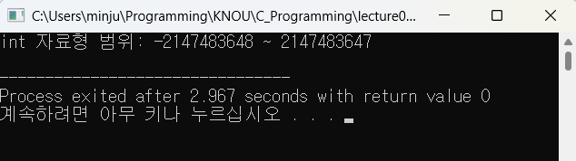

    - 문자형의 사용 예
        ```c
        #include <stdio.h>

        int main()
        {
            char ch1;
            ch1 = 'A';  // 코드값(10진수):65 >> (16진수):41
            printf("ch1 = '%c'\n", ch1);
            printf("'%c'의 ASCII 코드 = %d\n", ch1, ch1);
            
            char ch2 = 0x42;  // (16진수) 42 >> (10진수) 66 >> 문자 'B'
            printf("ASCII 코드 %d의 문자 = '%c'\n", ch2, ch2);
        }
        ```
        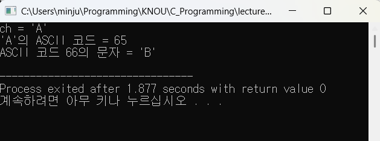

- 실수형
    - 부동소숫점(Floating point) 표현방식의 수(IEEE754 기준)
        |자료형|크기(byte)|값의 범위|
        |:---:|:---:|:---|
        |float|4|1.175, 494351⨯10⁻³⁸<br>~3.402823466⨯10³⁸|
        |double|8|2.2250738585072014⨯10⁻³⁰⁸<br>~1.7976931348623158⨯10³⁰⁸|
        |long double|8|2.2250738585072014⨯10⁻³⁰⁸<br>~1.7976931348623158⨯10³⁰⁸|
    - *`double`과 `long double`의 값의 범위가 같은데<br>이것은 미래에는 컴퓨터의 발전에 따라 값의 범위가 바뀔 수 있음.*  

    - 각 자료형의 값의 범위에서 
        - **왼쪽 경계값**은 <u>가장 미세한 값</u>(크기가 작은 값)
            - 가장 작은 값 X  
            (∵ *부호를 붙이면 더 작은 값을 만들 수 있음*)
        - **오른쪽 경계값**은 <u>가장 큰 값</u>
    
    <br>

    - 표현할 수 있는 값의 범위는 `float.h`에 정의된 값으로 확인할 수 있음.

        ```c
        #include <stdio.h>
        #include <float.h>

        int main()
        {
            double minDouble = DBL_MIN;
            double maxDouble = DBL_MAX;
            printf("double 자료형의 범위: %e ~ %e\n", minDouble, maxDouble);
        }
        ```
        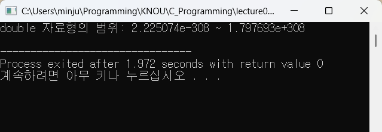

### 4. 열거형
- 열거형(Enumeration type)이란?
    - 나열된 단어를 값으로 사용하는 자료형
        - 나열된 순서대로 0부터 시작하는 정수를 표현함  
            ```c
            enum day {SUN, MON, TUE, WED, THU, FRI, SAT};
            ```
            |day||값|
            |---|---|---|
            |SUN|<b style="color:rgba(189, 1, 1, 1);">→</b>|<b style="color:rgba(189, 1, 1, 1);">0</b>|
            |MON|<b style="color:rgba(189, 1, 1, 1);">→</b>|<b style="color:rgba(189, 1, 1, 1);">1</b>|
            |TUE|<b style="color:rgba(189, 1, 1, 1);">→</b>|<b style="color:rgba(189, 1, 1, 1);">2</b>|
            |WED|<b style="color:rgba(189, 1, 1, 1);">→</b>|<b style="color:rgba(189, 1, 1, 1);">3</b>|
            |THU|<b style="color:rgba(189, 1, 1, 1);">→</b>|<b style="color:rgba(189, 1, 1, 1);">4</b>|
            |FRI|<b style="color:rgba(189, 1, 1, 1);">→</b>|<b style="color:rgba(189, 1, 1, 1);">5</b>|
            |SAT|<b style="color:rgba(189, 1, 1, 1);">→</b>|<b style="color:rgba(189, 1, 1, 1);">6</b>|
        - 특정 이름에 값을 지정할 수 있음
            > 값을 지정한 이름 다음에 오는 이름은 지정한 값의 다음 값을 가짐.
            ```C
            enum fruit {APPLE, PEAR, MANGO=4, GRAPE};
            ```
            |fruit||값|
            |---|---|---|
            |APPLE|<b style="color:rgba(189, 1, 1, 1);">→</b>|<b style="color:rgba(189, 1, 1, 1);">0</b>|
            |PEAR|<b style="color:rgba(189, 1, 1, 1);">→</b>|<b style="color:rgba(189, 1, 1, 1);">1</b>|
            |MANGO|<b style="color:rgba(189, 1, 1, 1);">→</b>|<b style="color:rgba(189, 1, 1, 1);">4</b>|
            |GRAPE|<b style="color:rgba(189, 1, 1, 1);">→</b>|<b style="color:rgba(189, 1, 1, 1);">5</b>|

    - 열거형 사용 예
        ```c
        #include <stdio.h>

        int main()
        {
            enum day {SUN, MON, TUE, WED, THU, FRI, SAT};
            enum fruit {APPLE, PEAR, MANGO=4, GRAPE};
            
            printf("TUE의 값 = %d\n", TUE);
            printf("PEAR의 값 = %d\n", PEAR);
            printf("GRAPE의 값 = %d\n", GRAPE);
        }
        ```
        

    <br>

    - 열거형 변수 이름에 대한 값을 모두 확인해 보고 싶어서 내가 써 본 코드
        ```c
        #include <stdio.h>

        int main()
        {
            enum day {SUN, MON, TUE, WED, THU, FRI, SAT};
            enum fruit {APPLE, PEAR, MANGO=4, GRAPE};
            
            printf("[열거형 변수 day의 값 출력하기]\n");
            printf("SUN의 값 = %d\n", SUN);
            printf("MON의 값 = %d\n", MON);
            printf("TUE의 값 = %d\n", TUE);
            printf("WED의 값 = %d\n", WED);
            printf("THU의 값 = %d\n", THU);
            printf("FRI의 값 = %d\n", FRI);
            printf("SAT의 값 = %d\n", SAT);
            
            printf("\n[열거형 변수 fruit의 값 출력하기]\n");
            printf("APPLE의 값 = %d\n", APPLE);
            printf("PEAR의 값 = %d\n", PEAR);
            printf("MANGO의 값 = %d\n", MANGO);
            printf("GRAPE의 값 = %d\n", GRAPE);
        }
        ```
        ![실행 결과 : [열거형 변수 day의 값 출력하기]\nSUN의 값 = 0\nMON의 값 = 1\nTUE의 값 = 2\nWED의 값 = 3\nTHU의 값 = 4\nFRI의 값 = 5\nSAT의 값 = 6\n\n[열거형 변수 fruit의 값 출력하기]\nAPPLE의 값 = 0\nPEAR의 값 = 1\nMANGO의 값 = 4\nGRAPE의 값 = 5](IMGs/example_enum2.png)

###  5.상수(Constant)
- 상수란?
    > 항상 고정된 값을 갖는 자료  

- C언어의 상수 표현
    > 자료형에 따라 정해진 문법에 따라 값을 표현함.  

    - 예
        - char형 : 작은따옴표(`''`) 안에 문자를 넣어서 표현 (`'a'`)
        - 정수형 : 소숫점 없이 숫자만 혹은 숫자와 부호로만 표현 (`123`, `-56`)
        - 실수형 : 소숫점을 표현, 때에 따라 지수 표현을 사용 (`1.2e-3`)
        - 문자열 : 큰따옴표(`""`) 안에 문자를 나열 (`"KNOU"`)

- 정수형 상수
    - 10진수, 8진수, 16진수로 표현
        |구분|예|비고|
        |:---:|:---|:---|
        |10진 상수|10, -45, 999|<u><b style="color:rgba(0, 89, 255, 1)">0~9</b> 범위의 숫자</u>를 사용함.<br>숫자의 <u>첫 자리는 0이 아니어야 함.</u>|
        |8진 상수|<span style="color:red">0</span>12, -<span style="color:red">0</span>55|<u><b style="color:rgba(0, 89, 255, 1)">0~7</b>범위의 숫자<u>를 사용함.<br>숫자의 <u>첫자리는 <b style="color:red">0</b>으로 시작함.</u>|
        |16진 상수|<span style="color:red">0x</span>0c, -<span style="color:red">0X</span>2D|<u><b style="color:rgba(0, 89, 255, 1)">0~9</b></u>, <u><b style="color:rgba(0, 89, 255, 1)">a~f</b></u>를 사용함.<br>숫자의 <u>첫 자리는 <b style="color:red">0x</b>로 시작함.</u>|
        |unsigned형|10<span style="color:red">u</span>, 012<span style="color:red">u</span> 0X0C<span style="color:red">U</span>|<b style="color:red">u</b>: <u>부호 없는 상수</u>를 표현하는 접미사|
        |long형|12345<span style="color:red">l</span>, 0XFF<span style="color:red">L</span>|<b style="color:red">l</b>:<u>long형의 상수</u>를 표현하는 접미사|
- 실수형 상수
    - 부동소수점 형 상수
    - double형이 기본 자료형임.
        |구분|예|비고|
        |:---:|:---|:---|
        |소수 형식|3<span style="color:red">.</span>14, -12<span style="color:red">.</span>345|소수점을 사용하여 표현|
        |지수 형식|1.2<span style="color:red">e</span>3, 5<span style="color:red">e</span>-2|10진수와 e를 사용하여 표현|
        |float형|3.14<span style="color:red">f</span>, 0.314E1<span style="color:red">F</span>|<span style="color:red">f</span>:float형을 표현하는 접미사|
        |long double형|3.14<span style="color:red">l</span>, 0.314E1<span style="color:red">L</span>|<span style="color:red">l</span>: long double형을 표현하는 접미사|

    - 참고
        - $n = a \times r^{b}$
            - $n$ : 표현하려는 실제 수
            - $a$ : 가수부(Mantissa; 유효 숫자)
            - $r$ : 기수(대개 10 또는 2)
            - $r$ : 지수부(Exponent; 소수점의 위치),  
                    가수부를 어느 만큼 이동시켜야 할 지를 나타내며, 숫자의 크기(scale)을 결정함.
        - $1230 = 1.23 \times 10^3$
            - 1230 : 실제 표현하려는 수
            - 123 : 가수부(= 유효 숫자)
            - 10 : 기수
            - 3 : 지수부
        - $1.2e3 = 1.2 \times 10^3, \ \ 5e-2 = 5 \times 10^{-2}$

- 문자형 상수
    - 작은따옴표(`''`)로 묶여 있는 1개의 문자
        - 영문자: `'a'~'z'`, `'A'~'Z'`
        - 숫자: `'0'~'9'`
        - 기호: `'+'`, `'-'`, `'@'`, `'#'` 등
        - 백색문자(white space): 보이지는 않지만 토큰을 구분해 주는 역할을 하는 문자  
            ▶️ `' '`, `'\t'`, `'\n'`, `'\r'`, `'\f'` 등
        - 널(null) 문자 (`'\0'`)
    - *내부적으로는 해당 문자의 ASCII 코드값 저장*

    - 특수한 문자의 표현: escape 문자 `'\'`를 이용하여 표현
        - 키보드에 나타나지 않는 문자, 작은 따옴표(`''`), 백슬래쉬(`'\'`) 문자 등
            |Escape 문자|기능|
            |:---:|:---|
            |'<span style="color:red">\\</span>a'|경고음(alarm) 출력|
            |'<span style="color:red">\\</span>b'|백 스페이스(back space)|
            |'<span style="color:red">\\</span>f'|새 페이지(Form feed)|
            |'<span style="color:red">\\</span>n'|줄 바꿈(New line)|
            |'<span style="color:red">\\</span>r'|행의 시작 위치로 이동(Carriage return)|
            |'<span style="color:red">\\</span>t'|수평 탭(Horizontal tab)|
            |<span style="color:rgba(97, 97, 97, 1)">'\v'</span>|<span style="color:rgba(97, 97, 97, 1)">*(참고) 수직 탭(Vertical tab)*</span>|
            |'<span style="color:red">\\</span>0'|널(null) 문자(ASCII 코드값이 0인 문자)|
        - 기본적인 방법으로 표현할 수 없는 문자  
            ▶️ 작은따옴표(`''`), `\` 문자 등  
            |Escape 문자|기능|
            |:---:|:---|
            |'<span style="color:red">\\</span>'', '<span style="color:red">\\</span>"'|작은따옴표(`'`), 큰따옴표(`"`)|
            |'<span style="color:red">\\</span>\\'|백슬래시(`\`)|

            - 큰따옴표 안에 큰 따옴표를 쓰고 싶을 때 혹은 작은따옴표 안에 작은따옴표를 넣을 때 사용
                - `'''` 의 표현 → `'\''`
                - `"ABC" "`의 표현 → `"ABC\" "`
        - ASCII 코드로 문자를 표현하는   
            ▶️ '<span style="color:red">\\</span>8진수코드' 또는 '<span style="color:red">\\x</span>16진수코드'  
            - 예: 문자 'A'의 표현 *('A'의 ASCII 코드값은 65)* → ` '<span style="color:red">\\</span>101' 또는 '<span style="color:red">\\x</span>41'

- 문자열 상수
    - 큰따옴표(" ")로 묶여 있는 일련의 문자  
        *문자열의 끝을 나타내기 위한 널 문자(`'\0'`)가 추가됨.*  
        - 예: 문자열 "SEOUL KOREA"  
            ➡️ [S][E][O][U][L][&nbsp;&nbsp;][K][O][R][E][A][<span style="color:red">\0</span>]

## 2. 변수
### 1. 변수(Variables)
- 변수란?
    - 프로그램에서 값을 저장하기 위한 기억공간
        - 프로그램 실행 도중 값을 변경할 수 있음.
    - 모든 변수는 사용하기 전에 미리 선언되어야 함.
- 변수의 특징
    - 모든 변수는 <u>이름</u>이 있다.
    - 모든 변수는 <u>정해진 자료형</u>이 있다.
    - 모든 변수는 <u>할당된 값</u>을 갖는다.
- 변수의 선언
    - 형식
        ```c
        자료형 변수명;

        // 동일한 자료형의 변수가 여러 개일 때, 여러 개의 변수 선언
        자료형 변수명1, 변수명2;
        ```
    - 예
        ```c
        // int형 변수 선언
        int a;  // 4byte에 해당하는 메모리가 만들어지고 그것을 a라고 부름
        // double형 변수 선언
        double b;  // 8byte에 해당하는 메모리가 만들어지고 그것을 b라고 부름
        
        /* 
        [변수에 값 할당하기]
        '=': 대입 혹은 치환의 의미
            왼쪽 변수에 어떤 값이 들어있던지 상관없이 오른쪽에 있는 수식의 값으로 치환
        */
        a = 3 + 2;  
        b = a / 4.0;
        ```
        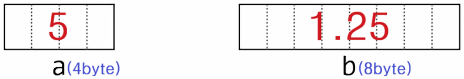

    - 변수 선언 시 고려해야 할 사항  
        ```txt
        ① 변수에 저장될 값의 크기  
        ② 변수의 선언 위치  
        ③ 변수의 초기화  
        ```

### 2. 변수 선언 시 고려해야 할 사항
- 변수에 저장될 값의 크기에 따라 발생할 수 있는 문제
    - 오버플로(Overflow), 언더플로(Underflow)
        - 표현할 수 있는 값의 범위를 벗어나는 문제
        - 언더플로(Underflow) : 부동소수점으로 표현할 수 있는 가장 크기가 작은 값보다 더 작은 값이 결과로 나왔을 때 발생

        ```c
        #include <stdio.h>
        #include <limits.h>

        int main()
        {
            short int num1, num2;  // short int는 2byte : -32768 ~ 32767
            
            num1 = 32767 + 1;  // num1에 32768대입 → 오버플로 발생!
            num2 = -32768 - 1;  // num2에 -32769대입 → 오버플로 발생!
            
            printf("short int 자료형 범위: %d ~ %d\n", SHRT_MIN, SHRT_MAX);
            printf("num1 = %d\n", num1);
            printf("num2 = %d\n", num2);
        }
        ```
        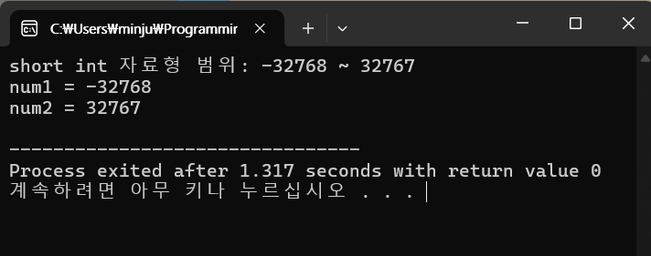

        - 위의 경우 num1, num2를 short int형이 아닌 int형으로 표현해야 함.

            ```c
            #include <stdio.h>
            #include <limits.h>

            int main()
            {
                int num1, num2;  // 값을 수용할 수 있는 자료형
                
                num1 = 32767 + 1;
                num2 = -32768 - 1;
                
                printf("int 자료형 범위: %d ~ %d\n", INT_MIN, INT_MAX);
                printf("num1 = %d\n", num1);
                printf("num2 = %d\n", num2);
            }
            ```
            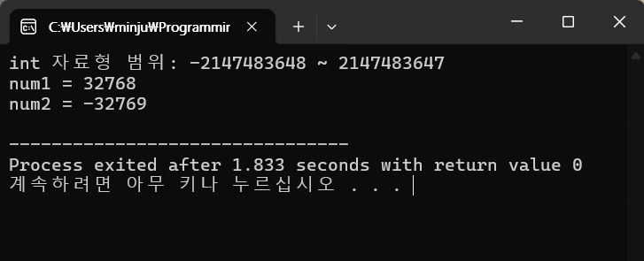

- 변수 선언 위치
    - 전역 변수 : 함수 바깥에서 선언한 변수
    - 지역 변수 : 함수 안에서 선언한 변수  
        변수가 선언된 함수 범위를 벗어나면 없는 변수나 마찬가지임.
    ```c
    int num;  // 함수 바깥에서 변수 선언 ⇨ 전역변수

    int main()
    {
        int i;  // main 함수 안에서 변수 선언 ⇨ 지역 변수
    }

    void sub()
    {
        // sub 함수 안에서 변수 선언 ⇨ 지역 변수(main의 i와는 별개임)
        int i;
        int j;
        ......
    }
    ```

    - 전역변수와 지역변수가 동일한 이름으로 선언되었을 때, 출력값이 어떻게 나올까?
        ```c
        #include <stdio.h>

        int a = 100;  // 전역 변수 a

        void func() {
            int a = 200;  // func() 함수 안에서 선언된 지역 변수 , 지역 변수 a가 전역 변수 a를 가려버림.
            printf("func()에서 a의 값 ==> %d\n", a);  // 지역 변수 a가 출력됨
        }

        int main() {
            printf("main()에서 a의 값 == > %d\n", a);  // 전역 변수 a가 출력됨.
            func();	
        }
        ```

        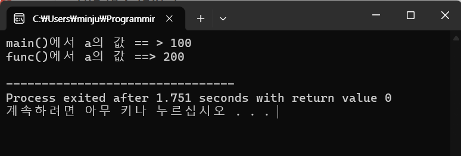

        *변수를 어디서 선언했는지, <u>변수 선언 위치</u>에 따라 <u>변수를 사용할 수 있는 영역(Scope)</u>의 차이가 발생*

- 변수의 초기화
    - 변수의 값을 사용하기 전에 적절한 값이 저장되어 있어야 함.
    - 변수가 어떤 값을 가지고 시작해야 된다는 것을 지정하는 것
    - 변수를 초기화 하지 않으면 해당 변수가 어떤 값이 들어있을지 모르는 상태의 값을 가짐  
        ⇨ 연산 결과도 ❓뭔지 모르는 값❔이 나오게 됨
    - 컴파일러에 따라 초기화하지 않은 변수를 사용한 연산 시, ☠️에러☠️가 발생할 수도 있음
        ```c
        #include <stdio.h>

        int main()
        {
            int i, sum;  // 변수를 만들기만 하고 초기화하지 않음

            for (i = 1; i <= 10; i++) 
                sum = sum + i;
            
            printf("1부터 10까지의 합=%d\n", sum);
        }
        ```

        


    - 변수 sum을 0으로 초기화해보자.
        ```c
        #include <stdio.h>

        int main()
        {
            int i, sum=0;

            for (i = 1; i <= 10; i++) 
                sum = sum + i;
            
            printf("1부터 10까지의 합=%d\n", sum);
        }
        ```
        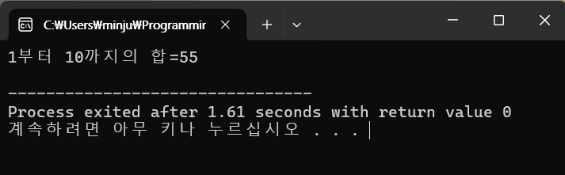

---

## 3. 선행처리기
### 1. 선행처리기(Preprocessing)
- 선행처리기란?
    - 컴파일에 앞서 소스 프로그램을 가공하여 컴파일러가 실제로 번역할 소스 프로그램을 만드는 것

        ```c
        #include <stdio.h>  /* 선행 처리를 지시하는 문장
                                (stdio.h라는 헤더 파일을 이 위치에 포함시켜라.)
        이 문장에 의해 실행할 때 뭔가가 이루어지는 것은 아님.
        컴파일 전에 먼저 처리되어 소스 코드가 가공된 후, 컴파일
        컴파일 전에 앞서서 한다고 하여 선행 처리라고 부름.*/

        int main()
        {
            printf("Hello, C프로그래밍\n");
        }
        ```
    - 선행처리 지시어(Preprocessing directives)로 지시함.
        - 선행처리 지시어는 '<span style="color:red">#</span>'로 시작함.  
            (*'#'은 Number sign, 샵, 해시 라고 부름*)
        - 선행처리 지시어 문장은 한 행에 한 개의 문장을 작성함.  
            (*한 개의 문장을 2줄로 나눠 쓸 수 없음.*)
        - 문장의 끝에 '<span style="color:red">;</span>'을 사용하지 않음.  
            (*한 행 단위로 문장이 작성되므로 문장의 끝을 특별히 알릴 필요 없음.*)
    - 대표적인 선행처리
        - 헤더파일 포함: `#include`
        - 매크로 선언 및 해제: `#define`, `#undef`
        - 조건부 컴파일: `#if`, `#else`, `#elif`, `#endif`

### 2. 헤더파일 포함
- #include 지시어
    - `a.c`
        ```c
        #include "a.h"

        문장_1;
        문장_2;
        문장_3;
        ......
        ```
    - `a.h`
        <pre style="color:gold">  문장_h1;
        문장_h2;
        문장_h3;</pre>

    ➡️ **선행처리 결과**  
    
    <pre>
    <span style="color:gold">문장_h1;
    문장_h2;
    문장_h3;</span>  
    
    문장_1;
    문장_2;
    문장_3;
    ......</pre>

    - 사용 형식
        - 형식1 : `#include <파일명>`  
            ⇨ 표준 디렉토리에서 파일을 찾음   
            ***표준 디렉토리**: C컴파일러에서 제공하는 헤더 파일들을 미리 정해진 곳에 모아놓은 곳  
            `stdio.h`, `stdlib.h`, `math.h`등 여러 파일들이 모여 있음.*

            ```c
            #include <stdio.h>
            ......
            ```
        - 형식2 : `#include "파일명"`  
            ⇨ 현재 사용중인 디렉토리, 또는 직접 지정한 경로에서 파일을 찾음

            ```c
            // 현재 파일명 : a.c
            #include "a.h"
            #include "sub/b.h"
            ......
            ```
            ```
            (현재 폴더)
            - a.c
            - a.h
            - sub
                - b.h
                ...
            ```
### 3. 매크로(Macro) 정의
- 매크로란?
    - 특정 코드 패턴으로 치환되도록 정의된 명칭
    - `#define`을 사용하여 자주 사용되는 명령이나 수식 또는 상수에 이를 대표하는 이름(매크로 이름)을 붙여 사용
- 매크로의 유형
    - 매크로 상수
    - 매크로 함수
- 매크로 상수 정의
    - 형식: `#define 매크로명 값`  
        ⇨ 매크로 확장: 프로그램 내의 '매크로명'을 '값'으로 치환함  

    - 예
        ```c
        #define PI 3.141592
        ```
        ⇨ 이후에 나오는 <code style="color:red">PI</code>는 <code style="color:red">3.141592</code>로 치환함.  
- 매크로 상수 해제
    - 형식: `#undef 매크로명`

- 매크로 상수 활용 예
    ```c
    #include <stdio.h>
    #define PI 3.141592

    int main()
    {
        double r = 10.0;
        printf("%lf\n", PI * r * r);  // printf("%lf\n", 3.141592 * r * r);
    }
    ```
    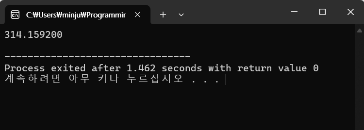

- 매크로 함수 정의
    - 형식: `#define 매크로명(인수리스트) (수식)`  
        ▷ 인수리스트: 1개 이상의 인수  
        ▷ 매크로 확장: 인수를 수식에 반영하여 매크로명을 치환함.  
        <b style="color:red">※ 주의</b>  
        매크로명이 수식의 텍스트로 치환되는 것이므로 적절히 <b style="color:red">괄호(`()`)</b>를 사용할 필요가 있음.

    - 예
        ```c
        #define C_AREA(x) (3.141592 * (x) * (x))
        ```
- 매크로 함수 활용 예
    ```c
    #include <stdio.h>
    #define C_AREA(x) (3.141592 * (x) * (x))

    int main()
    {
        double r = 10.0;
        printf("%lf\n", C_AREA(r));
    }
    ```
    ⇨  
    ```c
    #include <stdio.h>

    int main()
    {
        double r = 10.0;
        printf("%lf\n", (3.141592 * (r) * (r)));
    }
    ```
    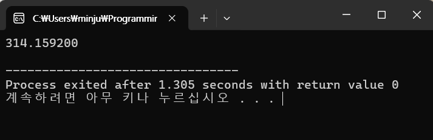

    - 왜 매크로 함수에 괄호를 써 주는걸까?  
        괄호를 빼고 다음의 연산을 실행시켜보자.  

        ```c
        #include <stdio.h>
        #define C_AREA(x) (3.141592 * x * x)

        int main()
        {
            double r = 5.0;
            printf("%lf\n", C_AREA(r + 5));
        }
        ```
        ⇨  매크로 함수에 괄호를 사용하지 않아 다음과 같은 연산을 실행하여 의도한 값과 다른 값이 출력되었다.
        ```c
        #include <stdio.h>

        int main()
        {
            double r = 5.0;
            printf("%lf\n", (3.141592 * r + 5 * r + 5));
        }
        ```
        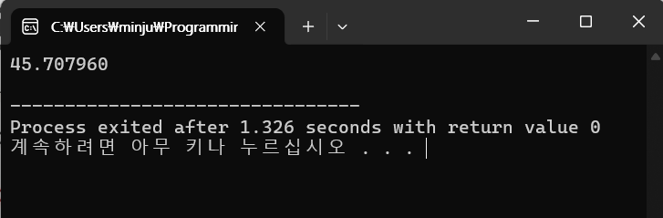
    - 매크로 함수에 괄호를 넣고 다시 계산해보자.
        ```c
        #include <stdio.h>
        #define C_AREA(x) (3.141592 * (x) * (x))

        int main()
        {
            double r = 5.0;
            printf("%lf\n", C_AREA(r + 5));
        }
        ```
        ⇨  매크로 함수에 괄호를 사용하여 함수를 정의하자 다음과 같이 연산되어 의도한 값과 일치한 값이 출력된다.
        ```c
        #include <stdio.h>

        int main()
        {
            double r = 5.0;
            printf("%lf\n", (3.141592 * (r + 5) * (r + 5)));
        }
        ```
        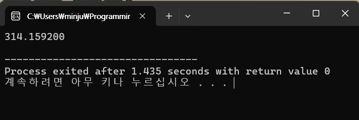
        
        
### 4. 조건부 컴파일
- 조건부 컴파일이란?
    - 조건에 따라 컴파일할 코드를 선택할 수 있게 하는 것
    - 형식
        <pre>
        <span style="color:red">#if 조건문</span>
        문장
        <span style="color:red">#endif</span></pre>

        - 조건문이 참인 경우 컴파일될 소스 코드에 '문장'이 포함됨.
        - <b style="color:red">주의</b>
            - 조건문은 선행처리과정에서 진위 여부를 판단할 수 있어야 함.
            - 변수 지정이나 함수 호출 불가
    
    - 형식(확장)
        <pre>
        <span style="color:red">#if 조건문</span>
        문장1
        <span style="color:red">#else</span>
        문장2
        <span style="color:red">#endif</span></pre>
        
        - 컴파일될 소스 코드에 포함될 문장
            - 조건문이 참인 경우, '문장1'
            - 조건문이 거짓인 경우, '문장2'
        
    - 형식 : 조건이 여러개 있는 경우
        <pre>
        <span style="color:red">#if 조건문1</span>
        문장1
        <span style="color:red">#elif 조건문2</span>
        문장2
        <span style="color:red">#else</span>
        문장3
        <span style="color:red">#endif</span></pre>

        - 컴파일될 소스 코드에 포함될 문장
            - 조건문1이 참인 경우, '문장1'
            - 조건문1이 거짓이고 조건문2가 참인 경우, '문장2'
            - 조건문1과 조건문2 모두 거짓인 경우, '문장3'
- 조건부 컴파일 활용 예
    ```c
    #include <stdio.h>
    #define DEBUG_MODE 1

    int main()
    {
        int a = 10, b = 20;

    #if DEBUG_MODE
        printf("평균을 구할 값: %d, %d\n", a, b);
    #endif
        printf("평균 = %f\n", (a + b) / 2.0);
    }
    ```
    ⇨ C언어에서는 0이 아닌 값을 참으로 취급,  
        `DEBUG_MODE`가 1이므로 참이어서 선행처리과정에서 평균을 구할 값 출력을 지시하는 문장을 소스 코드에 포함.
    ```c
    #include <stdio.h>

    int main()
    {
        int a = 10, b = 20;

        printf("평균을 구할 값: %d, %d\n", a, b);
        printf("평균 = %f\n", (a + b) / 2.0);
    }
    ```

    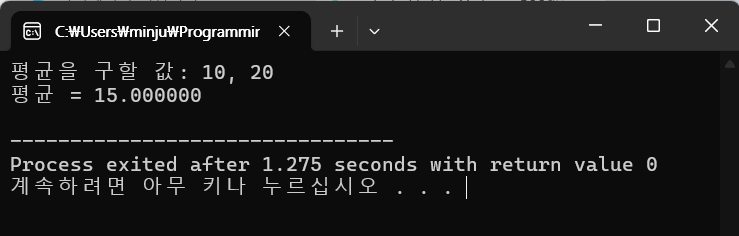

    - 만약 `DEBUG_MODE`를 0으로 바꾼다면?

        ```c
        #include <stdio.h>
        #define DEBUG_MODE 0

        int main()
        {
            int a = 10, b = 20;

        #if DEBUG_MODE
            printf("평균을 구할 값: %d, %d\n", a, b);
        #endif
            printf("평균 = %f\n", (a + b) / 2.0);
        }
        ```
        ⇨ 조건문이 거짓이므로 추가되는 선행처리과정에서 소스 코드에 추가되는 문장 없음.
        ```c
        #include <stdio.h>

        int main()
        {
            int a = 10, b = 20;

            printf("평균 = %f\n", (a + b) / 2.0);
        }
        ```
        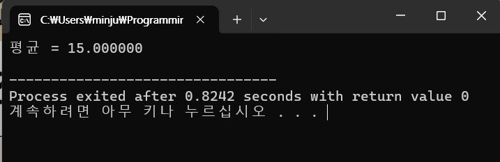

## 정리하기
- 프로그래밍 언어에서는 값을 저장하거나 계산을 할 때 자료형을 엄격하게 구분하여 처리한다.  
    (*이것이 맞지 않으면 제대로 연산을 할 수 없음*)
- C언어의 자료형에는 정수, 실수, 문자를 표현하는 기본형과 열거형, 파생형이 있다.
- 문자형과 정수형은 정수 형태의 값을 표현하며  
    자료형에 따라 1, 2, 4, 8바이트의 메모리에 값을 저장한다.  
    int형은 컴퓨터에서 가장 효율적인 처리를 할 수 있는 단어(word)의 크기로 저장한다.
- 실수형은 부동소숫점 표현방식의 자료형이다.
- 열거형은 나열된 단어를 값으로 사용하는 자료형으로,  
    나열된 순서대로 0부터 시작하는 정수를 표현한다.
- 상수는 항상 고정된 값을 표현하며,  
    자료형에 따라 정해진 문법에 맞게 표기한다.
- 변수는 프로그램에서 값을 저장하기 위한 기억공간(변하는 값을 표현하기 위한 것)으로,  
    사용하기 전에 이름과 자료형을 지정하여 선언한다.
- 선행처리는 컴파일에 앞서 소스 프로그램을 가공하여 컴파일러가 실제로 번역할 소스 프로그램을 만드는 것이다.
- 대표적인 선행처리에는 헤더파일 포함, 매크로 선언, 조건부 컴파일 등이 있다.


<br>

> 다음 시간 안내  
> [3강. 입.출력 함수와 연산자(1)](../lecture03/03_IO_Functions_and_Operators1.md)  