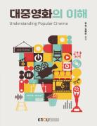

# 대중영화의이해
> 컴퓨터과학과 | 2025년  1학년 2학기 | 일반선택 | 3학점  
> 주차 : 15강  

  

## 강의 개요
> 본 과목은 매스커뮤니케이션의 한 분야로서 영화에 관한 기초적인 이론과 영화문화 및 영화 산업에 관한 올바른 이해를 목적으로 한다. 이 과목을 통해 학생들은 예술이자 산업으로서의 대중영화에 대한 포괄적인 지식과 정보를 습득함을 목표로 한다.  

 

(제작PD : 방태석)

  

---

## 교수 소개
> ### 장일  
> 사회과학대학 미디어영상학과교수  

  

---

## 교재 정보
<table><tr><td></td><td><h3>대중영화의이해</h3>
집필(장일, 김예란) 지음 | 출판문화원
 
종이책
21,800원

</td></tr></table>

  

---

## 강의 목차
> [1강. 영화의 탄생](./01_Birth_of_a_movie.md)  
[1강. 영화의 탄생](./01_Birth_of_a_movie.md)  
[2강. 영화의 역사 1](./02_History_of_Movies1.md)  
[3강. 영화의 역사 2](./03_History_of_Movies2.md)  
[4강. 영화의 역사 3](./04_History_of_Movies3.md)  
[5강. 영화언어](./05_Cinematic_Language.md)  
[6강. 내러티브와 장르](./06_Narrative_and_genre.md)  
[7강. 영화제작](./07_Movie_Production.md)  
[8강. 영화산업](./08_Movie_Industry.md)  
[9강. 대중문화와 관객](./09_Pop_culture_and_audience.md)  
[10강. 문화 비평과 영화 비평](./10_Cultural_Criticism_and_Movie_Criticism.md)  
[11강. 영화와 사랑](./11_Movies_and_Love.md)  
[12강. 영화와 인간](./12_movies_and_humans.md)  
[13강. 영화와 인간관계](./13_Movies_and_relationships.md)  
[14강. 영화와 사회변화](./14_Movies_and_Social_Changes.md)  
[15강. 영화와 정치](./15_Movies_and_politics.md)  
  