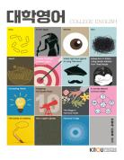

# 대학영어
> 컴퓨터과학과 | 2025년  1학년 2학기 | 교양 | 3학점  
> 주차 : 15강  

  

## 강의 개요
> <대학영어>는 영어 지문을 읽고 정확하게 의미를 파악할 수 있는 능력, 그리고 배운 어휘를 활용하여 자연스러운 영어 문장을 만들 수 있는 능력을 키우는 것을 목적으로 한다. <대학영어>에서 읽게 될 글들은 21세기를 살아가는 현대인으로서 흥미를 느낄 수 있는 다양한 주제를 다룬다. 1강부터 8강까지는 어휘와 구문 학습에 중점을 두어 수업이 진행되고, 이를 바탕으로 하여 9강부터는 좀더 긴 호흡의 문장을 읽어나간다. 영어 지문을 원어민이 읽어 녹음한 파일이 제공되며, 워크북에서는 지문에 대한 우리말 해석과 연습문제가 제공된다.

(* 유아교육과의 경우, 아래 및 U-KNOU 캠퍼스의 ‘강의공지’에 업로드된 강의계획서를 자세히 참조 바람)  

 

(제작PD : 권미진)

  

---

## 교수 소개
> ### 손향숙  
> 인문과학대학 영어영문학과교수 
> ### 신현욱  
> 인문과학대학 영어영문학과교수  

  

---

## 교재 정보
<table><tr><td></td><td><h3>대학영어</h3>
집필(손향숙, 신현욱) 지음 | 출판문화원
 
E-book
5,550원
(180일 대여)

</td></tr><tr><td></td><td><h3>대학영어</h3>
집필(손향숙, 신현욱) 지음 | 출판문화원
 
종이책
11,100원

</td></tr></table>

  

---

## 강의 목차
> [1강. Part I, Unit 1_Virus [1]](./01_PartI_Unit01_Virus1.md)  
[1강. Part I, Unit 1_Virus [1]](./01_PartI_Unit01_Virus1.md)  
[2강. Unit 1_Virus [2]](./02_Unit01_Virus2.md)  
[3강. Unit 2_Ancient Egypt [1]](./03_Unit02_Ancient_Egypt1.md)  
[4강. Unit 2_Ancient Egypt [2]](./04_Unit02_Ancient_Egypt2.md)  
[5강. Unit 4_Fear [1]](./05_Unit04_Fear1.md)  
[6강. Unit 4_Fear [2]](./06_Unit04_Fear2.md)  
[7강. Unit 7_“Artists Fight Back against AI Using Their Work” [1]](./07_Unit07_Artists_Fight_Back_Against_AI_Using_their_work1.md)  
[8강. Unit 7_“Artists Fight Back against AI Using Their Work” [2]](./08_Unit07_Artists_Fight_Back_Against_AI_Using_their_work2.md)  
[9강. Part II, Unit 9](./09_PartII_Unit09.md)  
[10강. Unit 9](./10_Unit09.md)  
[11강. Unit 11](./11_Unit11.md)  
[12강. Unit 11](./12_Unit11.md)  
[13강. Unit 13](./13_Unit13.md)  
[14강. Unit 13](./14_Unit13.md)  
[15강. Unit 15](./15_Unit15.md)  
  